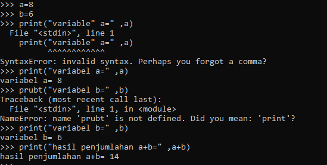
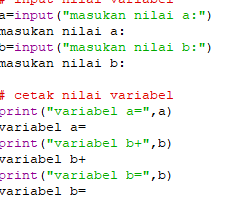
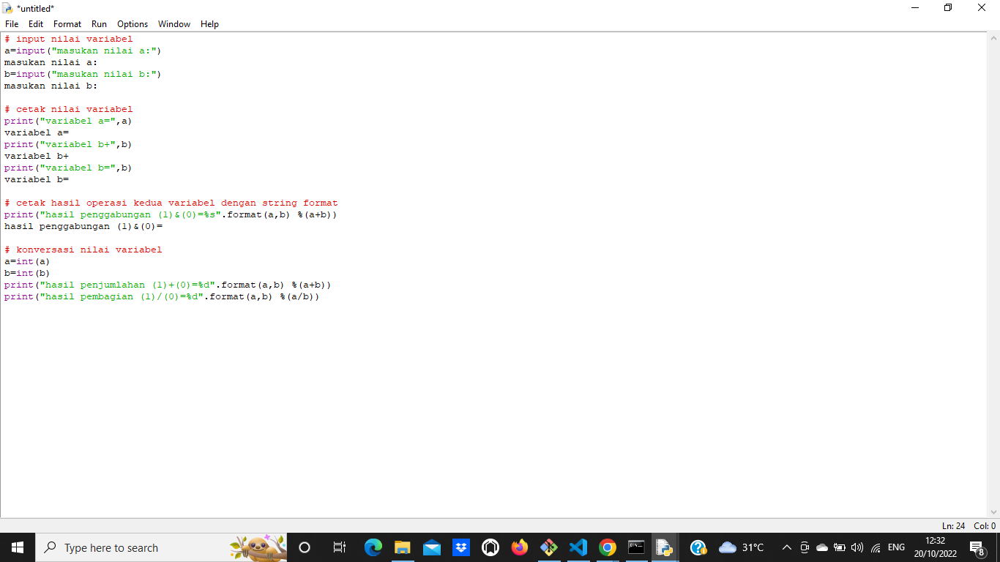

#lab2py

# sahrul
## Latihan 1
# Syntax Dasar
Dibawah ini adalah contoh fungsi Python yang digunakan untuk mencetak. Di Python untuk mencetak cukup gunakan fungsi print("")
```
print("Hello")
```
Outputnya akan seperti ini


```
print("Saya sedang belajar python")
```


## Latihan 2
# Penggunaan Variabel Dasar
Dilatihan kedua ,kita bisa menukarkan isi dari dua variabel tanpa harus menggunakan variabel tambahan yang dicadangkan untuk menyimpan nilai-nilai. Ini berarti bahwa ketika Anda membuat sebuah variabel Anda memesan beberapa ruang di memori.
```
a=8
b=6
```
Mendifinisikan terlebih dahulu variabel dari a dan b dengan menggunakan tanda =
# Mencetak Nilai Variabel 
Mencetak Nilai variabel bisa menggunakan 
```
print("variabel a=",a)
print("variabel b=",b)
```
Outputnya akan seperti ini



# Penjumlahan Nilai variabel
Dibawah ini adalah contoh penggunaan penjumlahan dari kedua variabel
```
print("hasil penjumlahan a+b=",a+b)
```
Maka Output nya akan seperti ini


## Latihan 3
# Menginput nilai Variabel dengan IDLE Python
Penggunaan IDLE python untuk menginput nilai variabel dengan cara
```
a=input("masukkan nilai a:")
b=input("masukkan nilai b:")
```
# Cetak nilai Variabel
Penggunaan IDLE python untuk mencetak nilai kedua variabel dengan cara
```
print("Variabel a=",a)
print("Variabel b=",b)
```
Outputnya akan seperti ini



# Penggabungan kedua variabel
Penggunaan IDLE python untuk penggabungan nilai kedua variabel dengan cara String Format
```
print("Hasil Penggabungan {1}+{0}=%s".format(a,b) %(a+b))
```
Outputnya akan seperti ini


# Konversi kedua nilai variabel
Penggunaan python untuk mengkonversi nilai kedua variabel dengan 
```
a=int(a)
b=int(b)
print("Hasil Penjumlahan {1}+{0}=%d").format(a,b) %(a+b))
print("Hasil Pembagian {1}+{0}=%d").format(a,b) %(a/b))
```
Outputnya akan seperti ini 


